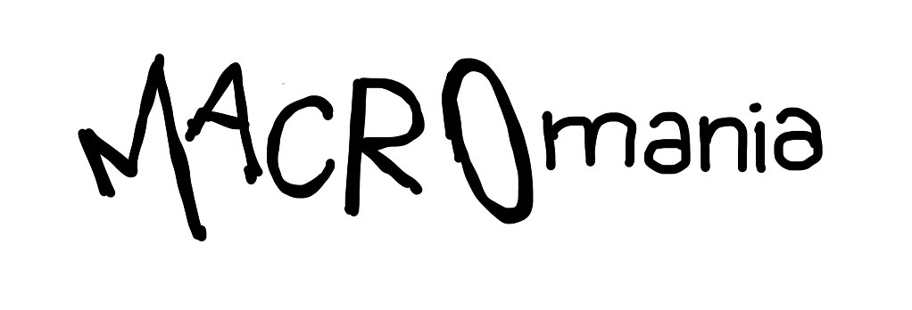

Text generation made ~~easy~~ simple.

```tsx
<Definition id="tree" title="Tree">
  A <Def>tree</Def> is a connected graph on <Tex>n</Tex> vertices
  with <Tex>n - 1</Tex> edges<Cite id="Diestel2016" />.
</Definition>
```

Macromania is a typescript-embedded domain-specific language for creating
strings, using [jsx syntax](https://en.wikipedia.org/wiki/JSX_(JavaScript)). You
can think of it as a highly expressive but completely unopinionated templating
language. It takes inspiration from lisp-like macro expansion and
[TeX](https://en.wikipedia.org/wiki/TeX), but the design ensures meaningful
error reporting, principled interaction between stateful macros, and static
typing for the input expressions.

To learn how to use it, [read the tutorial](./test/tutorial.tsx). To learn how it
works, [read the source](./main.ts).

Macromania is not a UI library, nor concerned with interactivity. It produces
static text.

## JSX Configuration

To use jsx syntax for Macromania, you need to configure your typescript compiler
(here an example for
[deno](https://docs.deno.com/runtime/manual/getting_started/configuration_file)):

```json
{
  "compilerOptions": {
    "jsx": "react-jsxdev",
    "jsxImportSource": "macromaniajsx"
  },
  "imports": {
    "macromaniajsx/jsx-dev-runtime": "path/to/macromanias/main.ts"
  }
}
```

